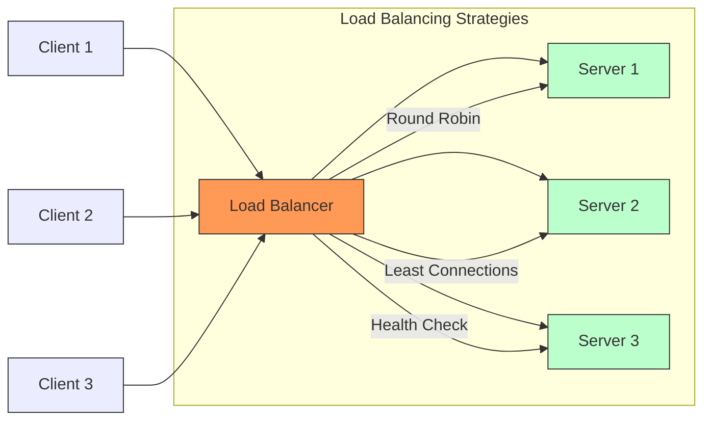

```mermaid
graph LR
    C1[Client 1] --> LB[Load Balancer]
    C2[Client 2] --> LB
    C3[Client 3] --> LB
    
    LB --> S1[Server 1]
    LB --> S2[Server 2]
    LB --> S3[Server 3]
    
    subgraph Load Balancing Strategies
    LB --Round Robin--> S1
    LB --Least Connections--> S2
    LB --Health Check--> S3
    end

    style LB fill:#f95,stroke:#333
    style C1 fill:#bbg,stroke:#333
    style C2 fill:#bbg,stroke:#333
    style C3 fill:#bbg,stroke:#333
    style S1 fill:#bfc,stroke:#333
    style S2 fill:#bfc,stroke:#333
    style S3 fill:#bfc,stroke:#333
```
