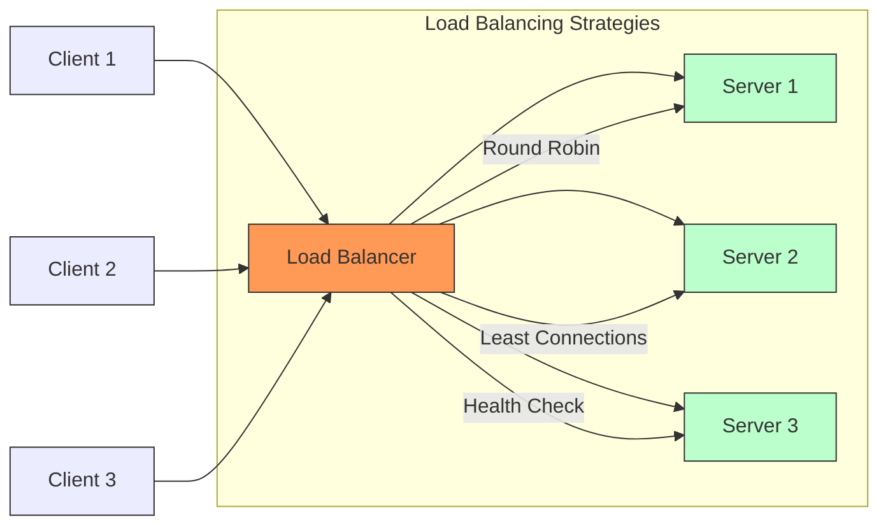

# Go Load Balancer Project

A simple but powerful HTTP load balancer implementation in Go, featuring round-robin load balancing and multiple backend server support. This project demonstrates core concepts of load balancing and can be used as a learning tool or starting point for more complex implementations.



## 🌟 Features

- Round-robin load balancing algorithm
- Real-time health monitoring of backend servers
- Automatic failover for unhealthy servers
- Multiple backend server support
- Easy-to-use test server implementation
- Concurrent request handling
- Simple setup and deployment
- Detailed logging and monitoring
- Health status toggle for testing scenarios

## 📁 Project Structure

```
loadbalancer/
├── main.go              # Load balancer implementation with health checks
├── servers/
│   └── main.go         # Test server implementation with health endpoints
├── start_servers.sh    # Script to start multiple test servers
└── README.md           # This file
```

## 🚀 Getting Started

### Prerequisites

- Go 1.16 or higher
- Basic understanding of HTTP and networking concepts
- Linux/Unix environment (for shell scripts)

### Installation

1. Clone the repository:
```bash
git clone https://github.com/williammuchui/load_balancer
cd load_balancer
```

2. Make the start script executable:
```bash
chmod +x start_servers.sh
```

### Running the Project

1. Start the backend test servers:
```bash
./start_servers.sh
```
This will start three server instances on ports 8081, 8082, and 8083.

2. Start the load balancer:
```bash
go run main.go
```
The load balancer will start on port 8080.

3. Test the setup:
```bash
# Check load balancer health
curl http://localhost:8080/health

# Test round-robin distribution
curl http://localhost:8080/test
```

### Health Check System

#### Endpoints
- `/health` - Returns server health status
- `/toggle` - Toggles server health (test servers only)

#### Testing Health Checks
```bash
# Check individual server health
curl http://localhost:8081/health
curl http://localhost:8082/health
curl http://localhost:8083/health

# Simulate server failure
curl http://localhost:8081/toggle

# Observe load balancer avoiding unhealthy server
curl http://localhost:8080/
```

### Stopping the Servers

To stop all backend servers:
```bash
kill $(cat server*.pid)
```

Stop the load balancer by pressing `Ctrl+C` in its terminal.

## 🔧 Configuration

### Load Balancer Configuration
- Default port: 8080
- Backend servers: http://localhost:8081, 8082, 8083
- Strategy: Round-robin with health checks
- Health check interval: 10 seconds
- Failure threshold: 3 consecutive failures

### Test Server Configuration
- Default ports: 8081, 8082, 8083
- Custom port can be specified using the `-port` flag
- Health check endpoint: `/health`
- Health toggle endpoint: `/toggle`
- Unique server identification in responses

## 🔍 How It Works

### Load Balancer
1. Receives incoming HTTP requests
2. Selects the next available healthy server using round-robin
3. Forwards the request to the selected server
4. Returns the response to the client

### Health Monitoring
1. Performs health checks every 10 seconds
2. Marks server as unhealthy after 3 consecutive failures
3. Automatically recovers servers when they become healthy
4. Skips unhealthy servers during load balancing

### Test Servers
- Each server runs independently
- Provides health check endpoint
- Allows manual health status toggling
- Logs all incoming requests
- Identifies itself in responses and headers

## 📊 Testing

### Basic Testing
```bash
# Send multiple requests to see round-robin in action
for i in {1..6}; do
    curl http://localhost:8080/
    echo
done
```

### Health Check Testing
```bash
# Monitor server health
watch -n 1 'curl -s http://localhost:8080/health'

# Simulate server failures
curl http://localhost:8081/toggle
```

## 🛠️ Advanced Usage

### Custom Health Check Configuration
You can modify the health check parameters in the code:
- Check interval (default: 10 seconds)
- Failure threshold (default: 3 attempts)
- Timeout duration (default: 5 seconds)

### Load Testing with Health Checks
```bash
# Install Apache Benchmark
sudo apt-get install apache2-utils

# Run load test
ab -n 1000 -c 10 http://localhost:8080/
```

## 🔒 Current Limitations

- Basic round-robin strategy only
- No persistent connections
- No SSL/TLS support
- Fixed health check parameters
- No configuration file support
- Basic health check criteria (HTTP 200 only)

## 🚧 Future Improvements

- [ ] Add advanced health check criteria (CPU, memory, response time)
- [ ] Implement weighted round-robin
- [ ] Add configuration file support
- [ ] Implement SSL/TLS support
- [ ] Add metrics and monitoring dashboard
- [ ] Docker containerization
- [ ] Advanced load balancing strategies
- [ ] Customizable health check parameters
- [ ] Health check history and trending
- [ ] Graceful server removal and addition

## 📝 Contributing

Feel free to fork the project and submit pull requests. For major changes, please open an issue first to discuss what you would like to change.

## 📄 License

This project is licensed under the MIT License - see the [LICENSE](LICENSE) file for details.

## 🤝 Acknowledgments

- Inspired by real-world load balancer implementations
- Built with Go's excellent standard library
- Community feedback and contributions
