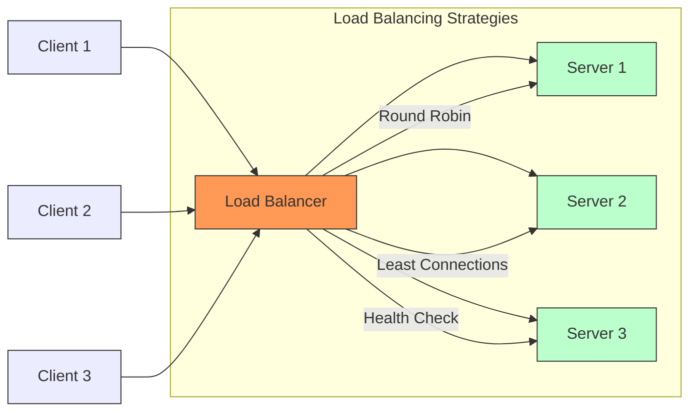

# Go Load Balancer Project

A simple but powerful HTTP load balancer implementation in Go, featuring round-robin load balancing and multiple backend server support. This project demonstrates core concepts of load balancing and can be used as a learning tool or starting point for more complex implementations.



## 🌟 Features

- Round-robin load balancing algorithm
- Multiple backend server support
- Easy-to-use test server implementation
- Concurrent request handling
- Simple setup and deployment
- Detailed logging and monitoring

## 📁 Project Structure

```
loadbalancer/
├── main.go              # Load balancer implementation
├── servers/
│   └── main.go         # Test server implementation
├── start_servers.sh    # Script to start multiple test servers
└── README.md           # This file
```

## 🚀 Getting Started

### Prerequisites

- Go 1.16 or higher
- Basic understanding of HTTP and networking concepts
- Linux/Unix environment (for shell scripts)

### Installation

1. Clone the repository:
```bash
git clone https://github.com/williammuchui/load_balancer
cd load_balancer
```

2. Make the start script executable:
```bash
chmod +x start-servers.sh
```

### Running the Project

1. Start the backend test servers:
```bash
./start_servers.sh
```
This will start three server instances on ports 8081, 8082, and 8083.

2. Start the load balancer:
```bash
go run main.go
```
The load balancer will start on port 8080.

3. Test the setup:
```bash
curl http://localhost:8080/test
```

### Stopping the Servers

To stop all backend servers:
```bash
kill $(cat server*.pid)
```

Stop the load balancer by pressing `Ctrl+C` in its terminal.

## 🔧 Configuration

### Load Balancer Configuration
- Default port: 8080
- Backend servers: http://localhost:8081, 8082, 8083
- Strategy: Round-robin

### Test Server Configuration
- Default ports: 8081, 8082, 8083
- Custom port can be specified using the `-port` flag
- Each server has unique identification in responses

## 🔍 How It Works

### Load Balancer
1. Receives incoming HTTP requests
2. Selects the next available backend server using round-robin
3. Forwards the request to the selected server
4. Returns the response to the client

### Test Servers
- Each server runs independently
- Provides detailed request information in responses
- Logs all incoming requests
- Identifies itself in responses and headers

## 📊 Testing

Basic testing can be performed using curl:

```bash
# Send multiple requests to see round-robin in action
for i in {1..6}; do
    curl http://localhost:8080/
    echo
done
```

Expected output will show responses from different backend servers in rotation.

## 🛠️ Advanced Usage

### Custom Port Configuration
Start a test server on a custom port:
```bash
go run servers/main.go -port 8084
```

### Load Testing
Using Apache Benchmark (ab):
```bash
ab -n 1000 -c 10 http://localhost:8080/
```

## 🔒 Limitations

- Basic round-robin strategy only
- No persistent connections
- No SSL/TLS support
- No advanced health checking
- No configuration file support

## 🚧 Future Improvements

- [ ] Add health checks for backend servers
- [ ] Implement weighted round-robin
- [ ] Add configuration file support
- [ ] Implement SSL/TLS support
- [ ] Add metrics and monitoring
- [ ] Docker containerization
- [ ] Advanced load balancing strategies

## 📝 Contributing

Feel free to fork the project and submit pull requests. For major changes, please open an issue first to discuss what you would like to change.

## 📄 License

This project is licensed under the MIT License - see the LICENSE file for details.

## 🤝 Acknowledgments

- Inspired by real-world load balancer implementations
- Built with Go's excellent standard library
- Community feedback and contributions
